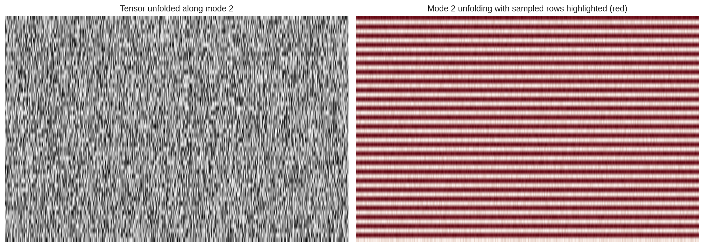
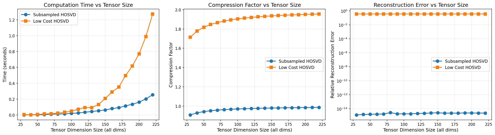

# Low Cost HOSVD 

I will make this file to showcase the issue with low cost SVD in combustion, I will make it as clear as possible at the risk of writing redundant stuff.

## Classical SVD

This section is for nomenclature

### Definition

For a matrix $\mathbf{X} \in \mathbb{R}^{m \times n}$, the Singular Value Decomposition (SVD) is defined as:

$$\mathbf{X} = \mathbf{U} \mathbf{\Sigma} \mathbf{V}^T$$

where:

- $\mathbf{U} \in \mathbb{R}^{m \times m}$ is an orthogonal matrix containing the left singular vectors
- $\mathbf{\Sigma} \in \mathbb{R}^{m \times n}$ is a diagonal matrix containing the singular values $\sigma_1 \geq \sigma_2 \geq ... \geq \sigma_r > 0$ (where $r = \text{rank}(\mathbf{X})$)
- $\mathbf{V} \in \mathbb{R}^{n \times n}$ is an orthogonal matrix containing the right singular vectors

The left singular vectors in $\mathbf{U}$ represent the orthogonal basis for the row space of $\mathbf{X}$, capturing patterns across the $m$ rows. The right singular vectors in $\mathbf{V}$ represent the orthogonal basis for the column space of $\mathbf{X}$, capturing patterns across the $n$ columns. The singular values in $\mathbf{\Sigma}$ quantify the importance or energy associated with each pair of singular vectors, ordered from most to least significant.

### Low-Rank Approximation

The truncated SVD provides the best rank-$k$ approximation to $\mathbf{X}$ in the least squares sense:

$$\mathbf{X}_k = \mathbf{U}_k \mathbf{\Sigma}_k \mathbf{V}_k^T = \sum_{i=1}^k \sigma_i \mathbf{u}_i \mathbf{v}_i^T$$

where $\mathbf{U}_k \in \mathbb{R}^{m \times k}$, $\mathbf{\Sigma}_k \in \mathbb{R}^{k \times k}$, and $\mathbf{V}_k \in \mathbb{R}^{n \times k}$ contain the first $k$ singular vectors and values.

The approximation error is:

$$\|\mathbf{X} - \mathbf{X}_k\|_F = \sqrt{\sum_{i=k+1}^r \sigma_i^2}$$

## Low Cost SVD

### Motivation

For large matrices where $n$ (number of columns) is very large, computing the full SVD is very expensive. The Low Cost SVD algorithm has as its purpose to recover a good approximation of all three matrices $\mathbf{U}$, $\mathbf{\Sigma}$, and $\mathbf{V}$. We consider the case of **short fat matrices**, i.e., $\mathbf{X} \in \mathbb{R}^{m \times n}$ with $m \ll n$. The first step is to subsample in the column space. Note that if we had a tall skinny matrix ($m \gg n$), as in the original paper, the discussion would be the same but the focus would change from using the algorithm to estimate the row matrix ($\mathbf{U}$) instead of the column matrix $\mathbf{V}$. For the sake of consistency with the HOSVD formulation, both the one from modelflows code and the one in the original paper, we discuss short fat matrices. Two of the three matrices come "for free" in the sense that, as a hypothesis of the algorithm, if we subsample in the column space and $n \gg m$, then $\mathbf{U}$ and $\mathbf{\Sigma}$ are considered almost unvaried: $\mathbf{U}_s \approx \mathbf{U}$ and $\mathbf{\Sigma}_s \approx \mathbf{\Sigma}$, where $\mathbf{U}_s$ and $\mathbf{\Sigma}_s$ are obtained from the SVD of the subsampled matrix $\mathbf{X}_s \in \mathbb{R}^{m \times n_s}$ with $n_s \ll n$.

To be even clearer, the goal of low cost SVD is to get a good estimate of the matrix concerning the orthogonal basis of the subsampled space from the singular values and the matrix concerning the orthogonal base for the unsampled space. Again, for the case we are considering, this means recovering $\mathbf{V}$ with $\mathbf{U}$ and $\mathbf{\Sigma}$.

### Algorithm

Given a matrix $\mathbf{X} \in \mathbb{R}^{m \times n}$ and a subsampling ratio $s < 1$, the Low Cost SVD proceeds as follows:

1. **Column Subsampling**: Select $n_s = \lfloor s \cdot n \rfloor$ columns from $\mathbf{X}$ to form a reduced matrix $\mathbf{X}_s \in \mathbb{R}^{m \times n_s}$

2. **SVD on Subsampled Matrix**: Compute the SVD of the subsampled matrix:
   $$\mathbf{X}_s = \mathbf{U}_s \mathbf{\Sigma}_s \mathbf{V}_s^T$$

3. **Extract Left Singular Vectors**: Use $\mathbf{U}_s \in \mathbb{R}^{m \times m}$ (or its truncated version $\mathbf{U}_{s,k} \in \mathbb{R}^{m \times k}$) as an approximation to the left singular vectors of the full matrix $\mathbf{X}$

4. **Recover Right Singular Vectors**: Then one can recover a good approximation of the right singular vectors by substituting $\mathbf{X}_s$ with $\mathbf{X}$:
   $$\mathbf{U}_s \mathbf{\Sigma}_s \mathbf{V}_s^T \approx \mathbf{X} \rightarrow \mathbf{V}^T \approx \mathbf{\Sigma}_s^{-1}\mathbf{U}_s^T\mathbf{X}$$

   Note the dimensions: $\mathbf{\Sigma}_s^{-1} \in \mathbb{R}^{m \times m}$, $\mathbf{U}_s^T \in \mathbb{R}^{m \times m}$, and $\mathbf{X} \in \mathbb{R}^{m \times n}$, yielding $\mathbf{V}^T \in \mathbb{R}^{m \times n}$.

In this way a good approximation of the right singular vectors is found without having to compute the SVD of the large matrix.

### Sidenote

If one tries to recover the right singular vectors **after having subsampled the columns**, the dimensions do not match (and it would make little to no sense). Specifically:

- From the subsampled SVD, we have $\mathbf{V}_s^T \in \mathbb{R}^{n_s \times n_s}$
- The full matrix requires $\mathbf{V}^T \in \mathbb{R}^{n \times n}$ (or at least $\mathbf{V}^T \in \mathbb{R}^{r \times n}$ where $r = \text{rank}(\mathbf{X})$)
- When attempting the reconstruction $\mathbf{V}^T \approx \mathbf{\Sigma}_s^{-1}\mathbf{U}_s^T\mathbf{X}$, we get $\mathbf{V}^T \in \mathbb{R}^{m \times n}$, but this should have $n$ rows corresponding to all columns, not $m$ rows

The problem is that $\mathbf{V}_s$ only contains information about the $n_s$ subsampled columns, not the full $n$ columns of the original matrix.

## Low Cost SVD on HOSVD

### Higher-Order Singular Value Decomposition (HOSVD)

For a tensor $\mathcal{X} \in \mathbb{R}^{n_1 \times n_2 \times n_3 \times ... \times n_n}$, the HOSVD decomposes the tensor as:

$$\mathcal{X} = \mathcal{S} \times_1 \mathbf{U}^{(1)} \times_2 \mathbf{U}^{(2)} \times_3 \mathbf{U}^{(3)} ... \times_n \mathbf{U}^{(n)}$$

where:

- $\mathcal{S} \in \mathbb{R}^{n_1 \times n_2 \times n_3 \times ... \times n_n}$ is the core tensor
- $\mathbf{U}^{(i)} \in \mathbb{R}^{n_i \times n_i}$ are orthogonal mode matrices for each dimension $i$
- $\times_i$ denotes the mode-$i$ product

The HOSVD algorithm proceeds as follows:

1. **Mode Unfolding**: For each mode $i = 1, 2, ..., d$, unfold the tensor $\mathcal{X}$ into a matrix $\mathbf{X}_{(i)} \in \mathbb{R}^{n_i \times \prod_{j \neq i} n_j}$

2. **SVD per Mode**: Compute the SVD of each unfolded matrix:
   $$\mathbf{X}_{(i)} = \mathbf{U}^{(i)} \mathbf{\Sigma}^{(i)} \mathbf{V}^{(i)T}$$

3. **Extract Mode Matrices**: Keep only $\mathbf{U}^{(i)}$ (or its truncated version) for each mode

4. **Compute Core Tensor**: The core tensor is obtained by:
   $$\mathcal{S} = \mathcal{X} \times_1 \mathbf{U}^{(1)T} \times_2 \mathbf{U}^{(2)T} \times_3 \mathbf{U}^{(3)T} \times_d ... \times_n \mathbf{U}^{(n)T}$$

### Main issue with low cost SVD

The HOSVD only requires the left singular vectors $\mathbf{U}^{(i)}$ from each mode unfolding (considering unfolding as short fat matrices). The $\mathbf{V}$ matrix is **not used** in the HOSVD algorithm. The right singular vectors $\mathbf{V}^{(i)}$ are discarded and play no role in the tensor decomposition or reconstruction, since their information is contained in the core tensor. The work I did last week is to understand which ways there are to find good $\mathbf{U}$ by reducing cost (paper sent by mail).

Therefore, the purpose of Low Cost SVD which would be to efficiently recover $\mathbf{V}^{(i)}$ is not useful for HOSVD, as only $\mathbf{U}^{(i)}$ is needed.

## Soledad's low cost HOSVD

The discussion so far provided is valid for a subsampling in the column space. The subsampling in the column space, which is what is done in literature, makes sense because an unfolded tensor has number of columns orders of magnitude more than number of rows, therefore a subsample in the column space does not change the rank of the matrix.

For example, a 4th-order tensor with number of elements $[n_1, n_2, n_3, n_4] = [100, 100, 100, 100]$ when unfolded will have dimensions:

$$100 \times (100 \times 100 \times 100) = 100 \times 10^6$$

The current implementation (Matlab code provided) subsamples in the row space to then recover the right eigenvalue matrix with the low cost procedure described before. This is not optimal for a couple of reasons:

- **Rank drop due to subsampling**: Subsampling in the row space can lead to loss of rank information
- **Computational cost increasing by using huge matrices to recover small matrices**: The recovery procedure involves manipulating large matrices to obtain small eigenvalue matrices

Both these reasons will be seen in the following discussion with pictures for the case of a three-dimensional tensor. The logic extends to higher dimensional tensors and the two factors get worse the higher the order of the tensor (the unfolded matrices are quite big).

### Explanation of the algorithm and the code

The low cost HOSVD algorithm works as follows:

1. **Tensor Unfolding and Row Subsampling**: The tensor $\mathcal{X} \in \mathbb{R}^{n_1 \times n_2 \times n_3}$ is unfolded along mode $k$ and rows are subsampled to create:
   $$X_{(k)}^{\text{sub}} \in \mathbb{R}^{m_k \times (n_j n_l)}$$
   where $m_k \ll n_k$ (subsampled rows).

   This would mean to take only a subset of the original points in the original tensor. For example taking one out every two rows in the last direction. Below the effect this has on a slice of the tensor and on the unfolded matrix.

   

   Here arises already the first problem, i.e. rank drop. A matrix with few rows and a lot of columns has rank equal to the number of rows. While subsampling in the column space (as done by the algorithms in literature) keeps the rank of the matrix the same, subsampling in the rows dimensions lowers the rank of the matrix equal to exactly the number of rows we have subtracted (it is destroying non trivial information).

2. **SVD on Subsampled Matrix**: Perform SVD on the subsampled unfolded matrix:
   $$X_{(k)}^{\text{sub}} = U_{\text{red}} \Sigma_{\text{red}} V_{\text{red}}^T$$
   where $U_{\text{red}} \in \mathbb{R}^{m_k \times r}$, $\Sigma \in \mathbb{R}^{r \times r}$, and $V_{\text{red}} \in \mathbb{R}^{(n_j n_l) \times r}$, with $r = \min(m_k, n_j n_l)$.

3. **Orthonormalization via QR Decomposition**: Both factor matrices are orthonormalized:

   - For $U_{\text{red}}$: Compute $QR = U_{\text{red}}$ and set $U_{\text{red}} \leftarrow U_{\text{red}} R^{-1}$
   - For $V_{\text{red}}$: Compute $QR = V_{\text{red}}^T$ and set $V_{\text{red}} \leftarrow (V_{\text{red}}^T R^{-1})^T$

   This is done for numerical stability.

4. **Sign Matrix Computation**: Compute a reduced core matrix:
   $$S_{\text{small}} = U_{\text{red}}^T X_{(k)}^{\text{sub}} V_{\text{red}}^T \in \mathbb{R}^{r \times r}$$

5. **Sign Correction**: Extract and apply sign corrections:
   $$\text{signs} = \text{sign}(\text{diag}(S_{\text{small}}))$$
   $$V_{\text{red}} \leftarrow V_{\text{red}}^T \cdot \text{diag}(\text{signs})$$

   This alongside with the past step is done for reproducibility.

   All in all steps 3 through 5 are technicalities and do not change the core idea of what the algorithm does.

6. **Recovery of Full Left Singular Vectors**: Using the full (non-subsampled) unfolded tensor $X_{(k)} \in \mathbb{R}^{n_k \times (n_j n_l)}$, recover the full left singular vectors:
   $$U = X_{(k)} V_{\text{red}}^T \Sigma_{\text{red}}^{-1} = U\Sigma V V_{\text{red}}^T\Sigma_{\text{red}}^{-1}$$
   where $U \in \mathbb{R}^{n_k \times r}$.

   

   Here we encounter the other problem with the algorithm, supposing the tensor is 3 dimensional with orders of $[n_1, n_2, n_3] = [100, 100, 100]$ and a reduction of half in the last index (take one every 2 points) the sizes of the matrices are:
   $$X_{(k)} \in \mathbb{R}^{100 \times 10000}, \quad V_{\text{red}}^T \in \mathbb{R}^{10000 \times 50}, \quad \Sigma_{\text{red}}^{-1} \in \mathbb{R}^{50 \times 50}$$

   The matrix multiplication $X_{(k)} V_{\text{red}}^T$ requires computing a $100 \times 10000$ matrix multiplied by a $10000 \times 50$ matrix, resulting in operations of order $\mathcal{O}(100 \times 10000 \times 50) = \mathcal{O}(5 \times 10^7)$.

   This is computationally expensive because we are using the full unfolded matrix (which has a huge number of columns) to recover a small matrix $U \in \mathbb{R}^{100 \times 50}$. The cost scales with the size of the full unfolded matrix, defeating the purpose of subsampling for computational efficiency.

   In contrast, if subsampling were done in the column space (as in standard literature), we would work with much smaller matrices throughout, avoiding this expensive recovery step entirely.

The fundamental issues with this approach are:

- **Rank degradation**: Row subsampling reduces the rank from $\min(n_k, n_j n_l)$ to $\min(m_k, n_j n_l)$, losing information
- **Computational inefficiency**: The recovery step requires expensive matrix multiplications with the full unfolded tensor, which has enormous column dimension
- **Scaling problems**: Both issues worsen for higher-order tensors where the column dimension grows exponentially with tensor order

7. **Final Orthonormalization**: Orthonormalize $U$ using QR decomposition:
   $$U \leftarrow Q \text{ where } QR = U$$

## Performance on generated random tensors

The first assessment of performance is performed on randomly generated tensors. We compare three approaches to computing approximate HOSVD:

We perform a sweep over increasing tensor sizes, starting from 50 and incrementing each dimension by 2 up to $150 \times 150 \times 150$ (this changes). For each tensor size, we measure three key metrics:

- **Computation Time**: Total time to compute the decomposition (all mode matrices and core tensor)
- **Compression Factor**: Ratio of original tensor size to decomposition size, defined as:
  $$\text{Compression} = \frac{n_1 \cdot n_2 \cdot n_3}{\text{core size} + \sum_i |\mathbf{U}^{(i)}|}$$
  where $|\mathbf{U}^{(i)}|$ denotes the number of elements in mode matrix $i$
- **Reconstruction Error**: Relative Frobenius norm error:
  $$\text{Error} = \frac{\|\mathcal{X} - \hat{\mathcal{X}}\|_F}{\|\mathcal{X}\|_F}$$

### Results

In order to get a readable graph, the subsampled HOSVD was manually truncated so that it retains exactly the same number of eigenvectors in the last mode as the low cost version. This is not optimal, but sufficient to show the better performance of the subsampled version of the algorithm over the low cost one:

**Figure**: Comparison of three HOSVD approximation methods across increasing tensor sizes. Left: Computation time showing the computational efficiency of each method. Middle: Compression factor indicating how much space the decomposition requires relative to the original tensor. Right: Reconstruction error (log scale) showing the approximation quality.
