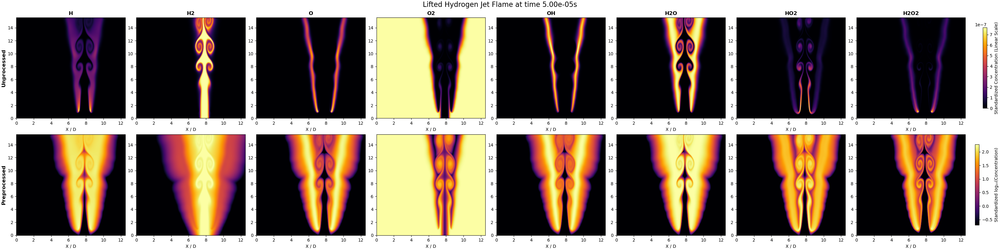
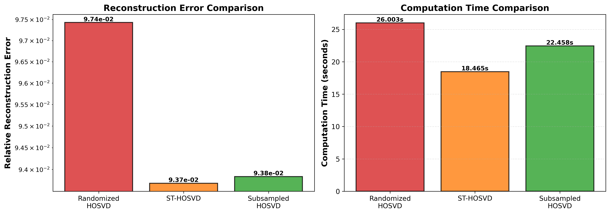
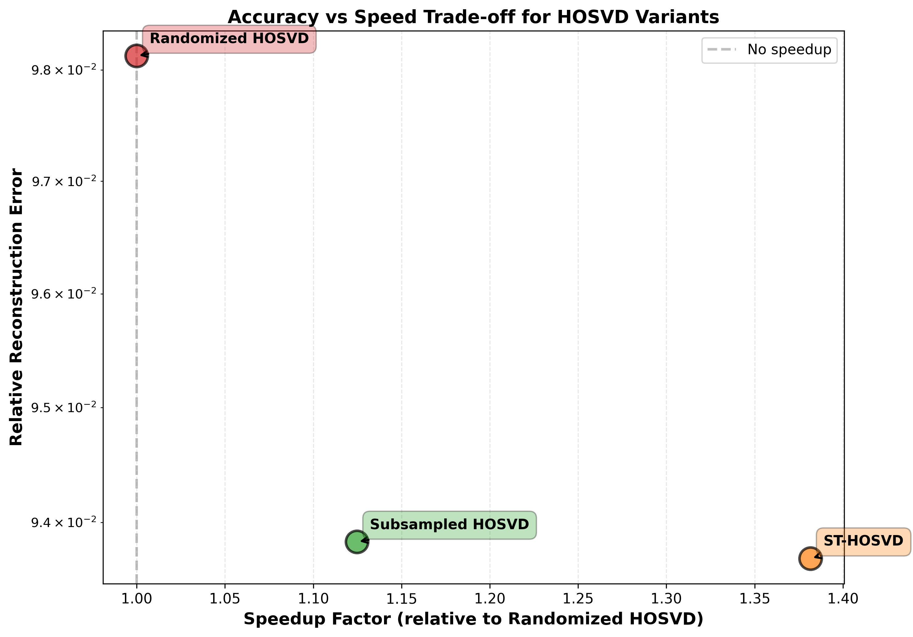

# Low Cost HOSVD for Combustion Data

## Overview

I found an article in which low cost HOSVD and other methods are explored ("Randomized Algorithms for Computation of Tucker Decomposition and Higher Order SVD (HOSVD)" Salman Ahmadi-Asl), I implemented the algorithms on the same dataset for the combustion conference. 

## Method

### Standard HOSVD

Tucker decomposition: **X** = **G** ×₁ **U**⁽¹⁾ ×₂ **U**⁽²⁾ ... ×ₙ **U**⁽ⁿ⁾

Each factor matrix **U**⁽ᵏ⁾ computed via SVD of mode-k unfolding **X**₍ₖ₎.

Computational cost: O(∑ₖ Iₖ² ∏ⱼ≠ₖ Iⱼ)

### Subsampling Approach

For each mode k:
1. Randomly sample m = α · ∏ⱼ≠ₖ Iⱼ columns from **X**₍ₖ₎
2. Compute SVD of sampled matrix **X̃**₍ₖ₎
3. Use left singular vectors as approximate **U**⁽ᵏ⁾

Reduced cost: O(α ∑ₖ Iₖ² ∏ⱼ≠ₖ Iⱼ)

### Other Low-Cost Methods Tested

**Randomized HOSVD**: Uses power iteration randomized SVD for each mode unfolding. Applies power iterations to improve accuracy of random projections before computing SVD.

**ST-HOSVD (Sequentially Truncated)**: Progressively truncates tensor after each mode computation. Core tensor shrinks as **X** → mode_dot(**X**, **U**₁ᵀ, mode=1) → mode_dot(..., **U**₂ᵀ, mode=2), reducing subsequent SVD costs.

## Data

Tensor: **X** ∈ ℝ^(400×320×8×200)
- Spatial: 320×400 grid (12.5D × 15.6D domain)
- Chemical species: 8 (H, H₂, O, O₂, OH, H₂O, HO₂, H₂O₂)
- Time: 200 snapshots

Preprocessing: Molar conversion → log-scaling → standardization

Truncation ranks: [20, 15, 8, 10] → Core: 24k elements (8533× compression)

*Unprocessed vs preprocessed tensor data showing 8 chemical species at t=10*

## Results

| Method | Time (s) | Speedup | Rel. Error |
|--------|----------|---------|------------|
| Standard HOSVD | 69.39 | 1.00× | ~0 |
| Randomized HOSVD | 24.64 | 2.82× | 0.0981 |
| ST-HOSVD | 17.83 | 3.89× | 0.0937 |
| Subsampled (α=0.3) | 21.90 | 3.17× | 0.0938 |

All low-cost methods achieve similar reconstruction accuracy (~9.4%). ST-HOSVD provides the best speedup (3.89×) with the lowest error.

*Reconstruction error and computation time comparison for low-cost HOSVD variants*

*Accuracy vs speed trade-off: speedup factor relative to Randomized HOSVD*

## Discussion

**Advantages**: Significant speedup with controlled approximation, reduced memory footprint, maintains parallelizability across modes.

**Limitations**: Introduces ~9% error vs near-exact standard HOSVD, stochastic sampling variability. Can be easily improved by compressing less
